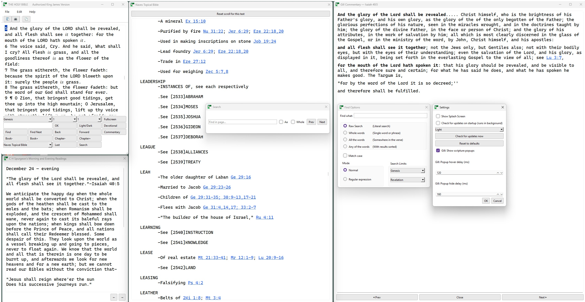

# Abib Bible Reader

A little, fast Bible reader for your desktop or laptop.
Abib helps you follow Scripture while listening to a sermon, a livestream, or during personal study.
It takes little room and has separate windows for the various parts.

## Why people like Abib
- Quick: jump to any verse instantly
- Compact: a tidy window that sits neatly beside video or notes
- Simple search: find words and phrases fast
- Built‑in daily readings: Spurgeon’s Morning & Evening
- Extras: Pilgrim’s Progress and other classic works included
- Light or Dark theme; font size you can adjust
- Works offline; no accounts, no telemetry

## Get Abib (Windows)
1) Download the latest installer:
   - https://github.com/Abib-ops/Abib/releases
2) Run the installer and follow the prompts.
3) Launch “Abib” from your Start menu.

Tip: Abib can also run from source for developers; most people will prefer the installer.

## Quick start
- Jump to a verse: type ge50.7 to go to Genesis 50:7 (use a period between chapter and verse)
- Or use the three drop‑down boxes (Book, Chapter, Verse)
- Search: open the Find dialog from the menu and enter a word or phrase
- Daily reading: open “Morning & Evening” and use the left/right controls
- Other books: use the bottom‑right drop‑down to open Pilgrim’s Progress and more

For tips and shortcuts (like changing font size), see HELP.txt in the repository or the installed folder.

## Questions
- Updates: Abib checks for updates and offers a download when a new version is available.
- Privacy: Abib works offline. It only accesses the internet to check for updates.
- License: Abib is free software (GPL‑3.0 or later). See LICENSE for details.

PDF resources
-------------

These Public Domain PDFs are distributed separately as release assets:

- [A Body of Practical Divinity - John Gill](https://github.com/Abib-ops/Abib/releases/download/414.15/A.Body.of.Practical.Divinity.-.John.Gill.pdf)
- [A Greek-English Lexicon of the NT - W. Grimm](https://github.com/Abib-ops/Abib/releases/download/414.15/A.Greek-English.Lexicon.of.the.NT.-.W.Grimm.pdf)
- [After the Flood TM](https://github.com/Abib-ops/Abib/releases/download/414.15/After.the.Flood.TM.pdf)
- [A Primary History of the British Isles TM](https://github.com/Abib-ops/Abib/releases/download/414.15/Britain.TM.pdf)
- [A Primary History of the British Isles BOOK 1](https://github.com/Abib-ops/Abib/releases/download/414.15/britain1.pdf)
- [A Primary History of the British Isles BOOK 2](https://github.com/Abib-ops/Abib/releases/download/414.15/britain2.pdf)
- [A Primary History of the British Isles BOOK 3](https://github.com/Abib-ops/Abib/releases/download/414.15/britain3.pdf)
- [Augustine and his confessions - B. B. Warfield](https://github.com/Abib-ops/Abib/releases/download/414.15/Augustine.and.his.confessions.-.B.B.Warfield.pdf)
- [Augustine and the Pelagian - B. B. Warfield](https://github.com/Abib-ops/Abib/releases/download/414.15/Augustine.and.the.Pelagian.-.B.B.Warfield.pdf)
- [BB Warfield Evolution and Early Fundamentalism - David Livingstone](https://github.com/Abib-ops/Abib/releases/download/414.15/BB.Warfield.Evolution.and.Early.Fundamentalism.-.David.Livingstone.pdf)
- [Bíbélì Mímọ́ Yorùbá Òde Òn](https://github.com/Abib-ops/Abib/releases/download/414.15/Bibeli.Mimo.pdf)
- [Bible Dictionary - W. Smith](https://github.com/Abib-ops/Abib/releases/download/414.15/Bible.Dictionary.-.W.Smith.pdf)
- [Bible Names Dictionary - R. D. Hitchcock](https://github.com/Abib-ops/Abib/releases/download/414.15/Bible.Names.Dictionary.-.R.D.Hitchcock.pdf)
- [Biblical Doctrines - B. B. Warfield](https://github.com/Abib-ops/Abib/releases/download/414.15/Biblical.Doctrines.-.B.B.Warfield.pdf)
- [Christian Martyrdom](https://github.com/Abib-ops/Abib/releases/download/414.15/Christian.Martyrdom.pdf)
- [Commentary on the Whole Bible - Matthew Henry](https://github.com/Abib-ops/Abib/releases/download/414.15/Commentary.on.the.Whole.Bible.-.Matthew.Henry.pdf)
- [Commentary Critical and Explanatory on the Whole Bible - Jamieson, Fausset, Brown](https://github.com/Abib-ops/Abib/releases/download/414.15/Commentary.Critical.and.Explanatory.on.the.Whole.-.Jamieson.Fausset.Brown.pdf)
- [Commenting and Commentaries - C. H. Spurgeon](https://github.com/Abib-ops/Abib/releases/download/414.15/Commenting.and.Commentaries.-.C.H.Spurgeon.pdf)
- [Concise Study of The Case Against Darwin](https://github.com/Abib-ops/Abib/releases/download/414.15/darwin.pdf)
- [Defending the Reformed Faith](https://github.com/Abib-ops/Abib/releases/download/414.15/defend.pdf)
- [Doctrinal Divinity - John Gill](https://github.com/Abib-ops/Abib/releases/download/414.15/Doctrinal.Divinity.-.John.Gill.pdf)
- [Doctrine of Election, The - A. W. Pink](https://github.com/Abib-ops/Abib/releases/download/414.15/Doctrine.of.Election.-.A.W.Pink.pdf)
- [Double-Predestination - R.C. Sproul](https://github.com/Abib-ops/Abib/releases/download/414.15/Double-Predestination.-.R.C.Sproul.pdf)
- [Easton's Bible Dictionary - M. G. Easton](https://github.com/Abib-ops/Abib/releases/download/414.15/Easton.s.Bible.Dictionary.-.M.G.Easton.pdf)
- [Enchiridion - St. Augustine](https://github.com/Abib-ops/Abib/releases/download/414.15/Enchiridion.-.St.Augustine.pdf)
- [Exposition of Songs - John Gill](https://github.com/Abib-ops/Abib/releases/download/414.15/Exposition.of.Songs.-.John.Gill.pdf)
- [Institutes - John Calvin](https://github.com/Abib-ops/Abib/releases/download/414.15/Institutes.-.John.Calvin.pdf)
- [Let My People Go](https://github.com/Abib-ops/Abib/releases/download/414.15/Let.My.People.Go.pdf)
- [Literature of the Modern Era](https://github.com/Abib-ops/Abib/releases/download/414.15/Literature.of.the.Modern.Era.pdf)
- [Literature of the Reformation Era](https://github.com/Abib-ops/Abib/releases/download/414.15/Literature.of.the.Reformation.Era.pdf)
- [March to Armageddon](https://github.com/Abib-ops/Abib/releases/download/414.15/March.to.Armageddon.pdf)
- [Morning and Evening Daily Readings - C. H. Spurgeon](https://github.com/Abib-ops/Abib/releases/download/414.15/Morning.and.Evening.Daily.Readings.-.C.H.Spurgeon.pdf)
- [Patrick Apostle to Ireland](https://github.com/Abib-ops/Abib/releases/download/414.15/patrick.pdf)
- [Puritan Bible Primer](https://github.com/Abib-ops/Abib/releases/download/414.15/Puritan.Bible.Primer.pdf)
- [Puritan Grammar Primer](https://github.com/Abib-ops/Abib/releases/download/414.15/Puritan.Grammar.Primer.pdf)
- [Real Story of Mankind](https://github.com/Abib-ops/Abib/releases/download/414.15/Real.Story.of.Mankind.pdf)
- [River Back to Eden](https://github.com/Abib-ops/Abib/releases/download/414.15/eden.pdf)
- [Robinson Crusoe](https://github.com/Abib-ops/Abib/releases/download/414.15/Robinson.Crusoe.pdf)
- [Studies in Theology - B. B. Warfield](https://github.com/Abib-ops/Abib/releases/download/414.15/Studies.in.Theology.-.B.B.Warfield.pdf)
- [Swahili New Testament](https://github.com/Abib-ops/Abib/releases/download/414.15/Swahili.New.Testament.pdf)
- [Systematic Theology - Index - Charles Hodge](https://github.com/Abib-ops/Abib/releases/download/414.15/Systematic.Theology.-.Index.-.Charles.Hodge.pdf)
- [Systematic Theology Vol I - Charles Hodge](https://github.com/Abib-ops/Abib/releases/download/414.15/Systematic.Theology.Vol.I.-.Charles.Hodge.pdf)
- [Systematic Theology Vol II - Charles Hodge](https://github.com/Abib-ops/Abib/releases/download/414.15/Systematic.Theology.Vol.II.-.Charles.Hodge.pdf)
- [Systematic Theology Vol III - Charles Hodge](https://github.com/Abib-ops/Abib/releases/download/414.15/Systematic.Theology.Vol.III.-.Charles.Hodge.pdf)
- [The Bible Doctrine of Election - C. D. Cole](https://github.com/Abib-ops/Abib/releases/download/414.15/The.Bible.Doctrine.of.Election.-.C.D.Cole.pdf)
- [The Doctrine of the Saints' Perseverance Explained - John Owen](https://github.com/Abib-ops/Abib/releases/download/414.15/The.Doctrine.of.the.Saints.Perseverance.Explained.-.John.Owen.pdf)
- [The Five Points](https://github.com/Abib-ops/Abib/releases/download/414.15/The.Five.Points.pdf)
- [The Inspiration and Authority of the Bible - B. B. Warfield](https://github.com/Abib-ops/Abib/releases/download/414.15/The.Inspiration.and.Authority.-.B.B.Warfield.pdf)
- [The Moravian Church - J. E. Hutton](https://github.com/Abib-ops/Abib/releases/download/414.15/The.Moravian.Church.-.J.E.Hutton.pdf)
- [The Person and Work of the Holy - B. B. Warfield](https://github.com/Abib-ops/Abib/releases/download/414.15/The.Person.and.Work.of.the.Holy.-.B.B.Warfield.pdf)
- [The Person Of Christ - B. B. Warfield](https://github.com/Abib-ops/Abib/releases/download/414.15/The.Person.Of.Christ.-.B.B.Warfield.pdf)
- [The Pilgrim's Progress](https://github.com/Abib-ops/Abib/releases/download/414.15/The.Pilgrim.s.Progress.pdf)
- [The Plan of Salvation - B. B. Warfield](https://github.com/Abib-ops/Abib/releases/download/414.15/The.Plan.of.Salvation.-.B.B.Warfield.pdf)
- [The Plan of Salvation - Hodge](https://github.com/Abib-ops/Abib/releases/download/414.15/The.Plan.of.Salvation.-.Hodge.pdf)
- [The Trinity - John Owen](https://github.com/Abib-ops/Abib/releases/download/414.15/The.Trinity.-.John.Owen.pdf)
- [The Works of Thomas Brooks - Thomas Brooks](https://github.com/Abib-ops/Abib/releases/download/414.15/The.Works.of.Thomas.Brooks.-.Thomas.Brooks.pdf)
- [Torey's New Topical Textbook - R.A.Torrey](https://github.com/Abib-ops/Abib/releases/download/414.15/Torey.s.New.Topical.Textbook.pdf)
- [Worship - John Owen](https://github.com/Abib-ops/Abib/releases/download/414.15/Worship.-.John.Owen.pdf)

## Credits
- Bible text: King James Version (Pure Cambridge Edition, from Matthew Verschuur)
- Morning & Evening by C. H. Spurgeon (via Eternal Life Ministries / spurgeongems.org)
- Other Works (public-domain texts) include authors such as:
  - John Bunyan — The Pilgrim's Progress; The Holy War
  - John Calvin — Institutes of the Christian Religion; Of Prayer, Commentaries
  - John Owen — Pneumatologia; Catechisms, The Doctrine of the Saints' Perseverance
  - Martin Luther — Commentary on Galatians; Small Catechism
  - Charles Hodge — Systematic Theology (Vols. I – III)
  - Orville J. Nave — Nave's Topical Bible
  - Arthur W. Pink — Election
  - C. D. Cole — Election
  - C. H. Spurgeon — The Puritan Catechism; Sermons on Proverbs
- Many public-domain texts were sourced via the Christian Classics Ethereal Library (CCEL, ccel.org).
- Project Gutenberg https://www.gutenberg.org/.
- The Library of Christian Classics
- archive.org
- 
© 2025 Andrew Kingston
